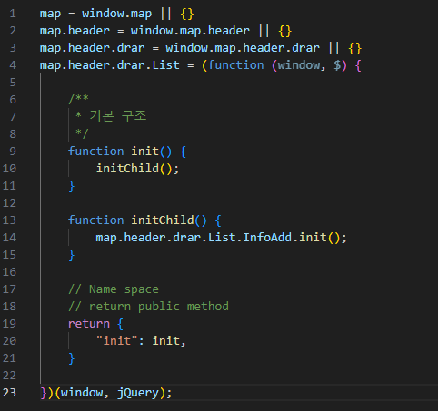
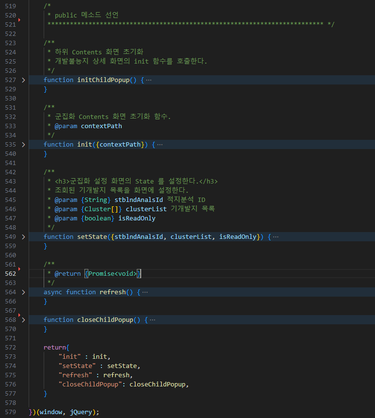

# Module Pattern 적용

## 문제점
실무에서 JQuery 기반 프로젝트를 개발하면서 기능 추가, 기능 오류, 기능 수정 등 다양한 상황 발생 시 한 기능을 수정하면 다른 기능이 안 되는 불상사를 많이 마주쳤었다. 

원인을 분석해보니 각 기능별 여러가지 기능에 종속되어 있어 코드가 엉켜있는 문제였다.(모듈화를 하지않았다.)

## 해결방안

기능별 모듈화를 하기위해 관련 디자인 패턴을 찾아보았는데 Module Pattern과 Singleton Pattern을 찾게되었다.

### Module Pattern vs Singleton Pattern

프로젝트 설계 단계에서 어떤 패턴을 참고할지 찾아보았다. 이전의 아픈 경험을 해소해줄 수 있도록 모듈화와 캡슐화를 목적으로 구성된 디자인 패턴인 Module Pattern과 Singleton Pattern 중 객체 간의 의존성을 명확하게 정의가 필요하여 Module Pattern을 채택하였다.

### Moduel Pattern
Moduel Pattern은 외부에서는 모듈의 공개된 부분에만 접근할 수 있으며 내부의 구현 세부 사항은 감춰진다.
이러한 방식으로 모듈을 구성하면 전역 네임스페이스의 오염을 방지할 수 있으며 의존성을 명확하게 정의하여 모듈 간의 상호 작용을 더 쉽게 관리하고 유지보수 측면에서 더 쉬워질거라 생각하였다.

## Module Pattern 설계

### 기본 구조

각 컴포넌트는 기본적으로 init 함수를 public으로 주어 부모 컴포넌트에서 자식 컴포넌트 초기화 함수(init())을 호출하는 형식을 위 소스 코드처럼 기본 구조로 잡았다.

최소한의 의존성으로 필요에 따라 public 함수로 빼주어 사용했다.

   
## 후기 
Modeul Pattern 적용 후 기능 추가 수정을 할 때의 부담감과 오류 처리를 하는데 시간이 눈에 띄게 단축 되었고 디버깅하는데도 수월해졌다. 
