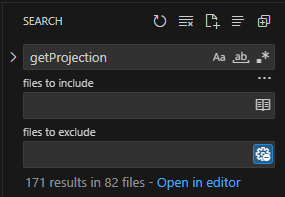

# Adapter Pattern 적용 

## 계기

사내 자바스크립트 기반한 라이브러리를 사용하는 프로젝트에 투입시 반복되는 문제점이 있었다. 그 문제점은 프로젝트를 라이브러리를 업데이트하거나 다운 그레이드를 해야될 상황에 생겼다.

## 문제점

- 라이브러리 형식적이지 않음(수정) : 
- 라이브러리를 직접 호출하여 사용 : 라이브러리를 직접 호출하다보니 오류가나는 메서드를 모두 직접 찾아서 수정하였다.

  
## 해결방안 
이러한 문제에 대응하기 위해 인터페이스를 통한 호출 방식을 도입하는 것이 필요하다는 결론을 내리게 되었다.

인터페이스 설계를 위해 여러 가지 디자인 패턴 중에서 어댑터 패턴과 데코레이터 패턴을 고려하였다.

### Adapter Pattern vs Decorator Pattern


Adappter Pattern은 기존 코드를 변경하지 않고 어댑터를 통해 새로운 라이브러리를 사용할 수 있는 장점이 있지만 기존 라이브러리의 인터페이스가 변경될 때마다 어댑터를 업데이트해야하는 단점이 있다.

Decorator Pattern은 주로 기능을 추가하거나 확장하는 데에 중점을 두기 때문에 라이브러리의 인터페이스와 직접적인 호환성 문제 해결에는 제한적이다.

나의 경우는 기능을 추가하거나 확장하긴 보단 기능을 인터페이스를 통해 호출하려하였다. 그리고 라이브러리의 일부의 기능만 사용하여 설계하는데 부담감이 적었고 라이브러리 버전 변경 시 일부분만 어댑터를 업데이트만 해주면 해결할 수 있는 상황이어서 Adappter Pattern를 채택하였다.


## 적용 

사용되는 함수를 어댑터를 만들어 호출하는 형식으로 만들었다.  

자주 사용되는 함수 중 getProjection 함수를 사용한 간단한 예시 코드다.


```
// 어댑터 함수
const odfAdapter = () =>{
    return {
        // 기존 라이브러리와 호환되는 인터페이스 제공
        getProjection: function() {
            return odfMap.get().getProjection();
        },
    };
}


// 어댑터를 함수 호출
const adapter = odfAdapter();

const clientCode = (adapter) =>{
    adapter.getProjection(); // 클라이언트는 어댑터를 통해 라이브러리와 상호작용
}

clientCode(adapter);
```

## 효과

getProjection 함수 같은 경우는 버전별로 호출되는 방식이 조금 다르다.


버전별 getProjection 함수 

버전 2.0  : odfMap.getView().getProjection();

버전 3.0  : odfMap.get().getProjection();



만약에 adapter를 통해 호출하지 않았다면 위와 사진과 같이 171개의 코드를 수정해야하는 상황이 올 것이다. 


지금 같은 경우 adapter를 통해 호출을 하였기 때문에 코드 한 줄만으로 오류를 잡을 수 있게되었다.

## 후기

나의 경우 사용하는 함수들이 적어서 설계하는데 부담감이 크진않았다. 


사용하는 함수가 많고 규모가 훨씬 커지면 Adapter패턴을 사용하여 인터페이스를 설계하는데 부담감도 커질거란 생각이들었다.


