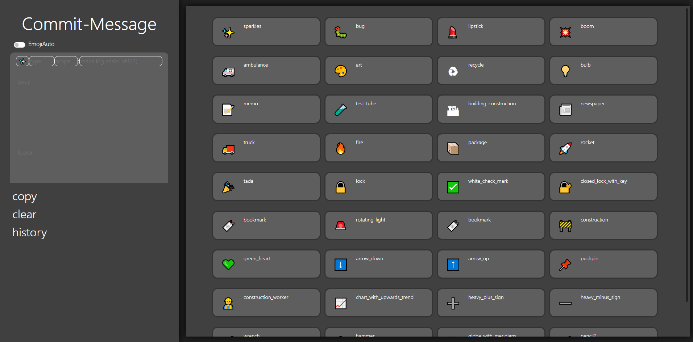

# Commit-Message 
좋은 커밋 메시지를 작성하도록 도와주는 웹사이트

## Source
<div style= "display: inline-flex;">
<a href="https://github.com/kwonyongjun1/commit-message"></a>
</div>

<div>

[👉 접속](https://kwonyongjun1.github.io/commit-message/)
</div>


## Language
<div style="display: inline-flex;">


</div>


## commit-message 화면 



## 시작한 계기
좋은 commit message는 프로젝트의 이력을 추적하고 변경 사항을 쉽게 찾을 수 있고 소스 변경된 내용에 대한 배경을 명확하게 알게되어 효율적인 협업을 할 수 있다. 
이걸 알게된 이후 commit message를 작성할 때 최대한 좋은 commit message형식에 맞추어 사용하려고 노력하였다.
<br/><br/>
현재 회사에서 참여하고 있는 프로젝트에서는 서로 간의 가이드나 규칙 없이 commit message를 작성한다.
<br/><br/>
앞으로의 효율적인 협업과 원활한 코드 리뷰를 위해 프로젝트 팀원들이 좋은 commit message를 보다 쉽게 작성할 수 있도록 프로젝트를 시작하게되었다.

## 만들기 전 고려사항
- 오프라인에서도 지원해야된다(내부망을 사용하는 프로젝트가 있다).
- PC 버전으로만 한다.
- 최대한 심플하게 만든다.


## Commit Message Basic Structure
```
{emoji} {type}({scope}): {subject} //header(제목)
​
{body} //body(본문)
​
{issue tracker} //footer(꼬리말)

{breaking change}
```
#### 가시성을 높이기위해서 메시지 앞에 gitEmoji를 사용하였다.
#### 커밋 메세지 구조는 참고자료와 주로 사용할 팀원들과 회의를 통해 결정하였다.

## 기능
### EmojiAuto
EmojiAuto 기능을 활성화 시 type 선택 시 해당 추천 Emoji를 자동으로 설정해준다.
### copy 
Commit-Message를 복사해준다.
### clear
Commit-Message 내용 삭제
### history
Commit-Message 복사한 이력을 보여준다.

## References
- [좋은 커밋 메시지 작성하기](https://github.com/sj960126/Commit-message)
- [gitmoji](https://gitmoji.dev/)

